# Data analysis with Spark

The dataset given gives information about enrgy in a power plant. A lot of values are missing,so data preparation will be very important

# Part I: Combined cycled power plant data set

## Data Preparation

We import our data on 2 data frames: one will remain intact and the second one will be cleaned

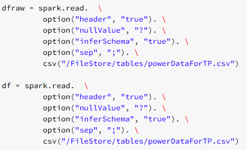 

If we look at our data set we can see that it contains a lot of missing values

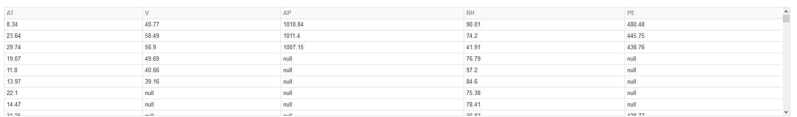 

To correct the missing values, we decided to fill them with the mean of each columns. Doing it ensured us not to change the characteristics of the dataset (min/max/mean and almost the stdev) but also to be able to use it more effectively

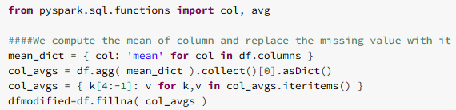 

When we look at the new set generated:

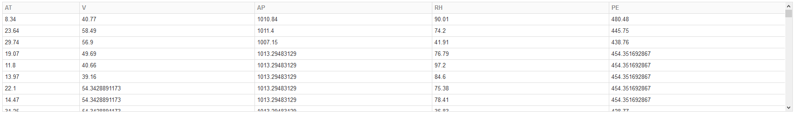 

Then we can compare the actual new statistics:

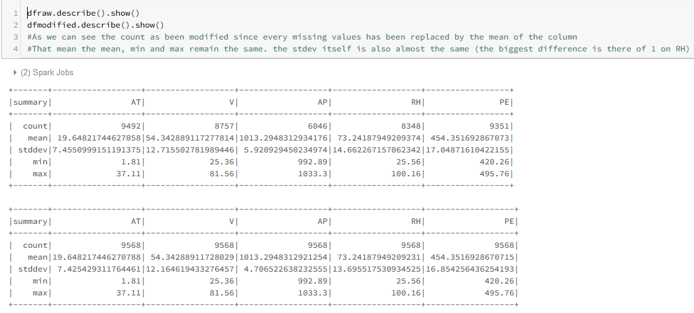 

- As expected, we didn&#39;t modified the characteristics much, but effectively filled the missing values

## Building the linear regression model

 

- We import the libraries
- We create our VectorAssembler removing the PE (output to predicted) column
- We split our data in a 70% / 30% proportion
- We create and fit our model

Repartition:

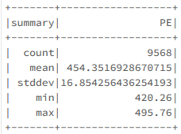 
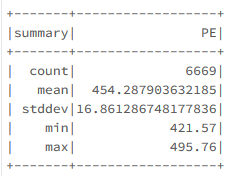 
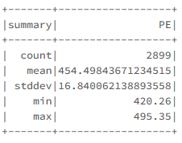 

Prediction:

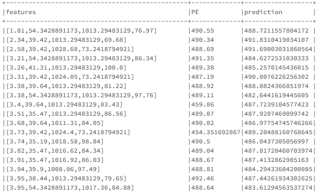 

Results:

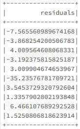 

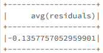 

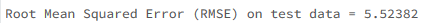 

- As we can see we are not that far away from the real result, but using CrossValidation and testing several parameters could improve our score

Then we try to optimize the parameters using Ridge and lasso regularization:

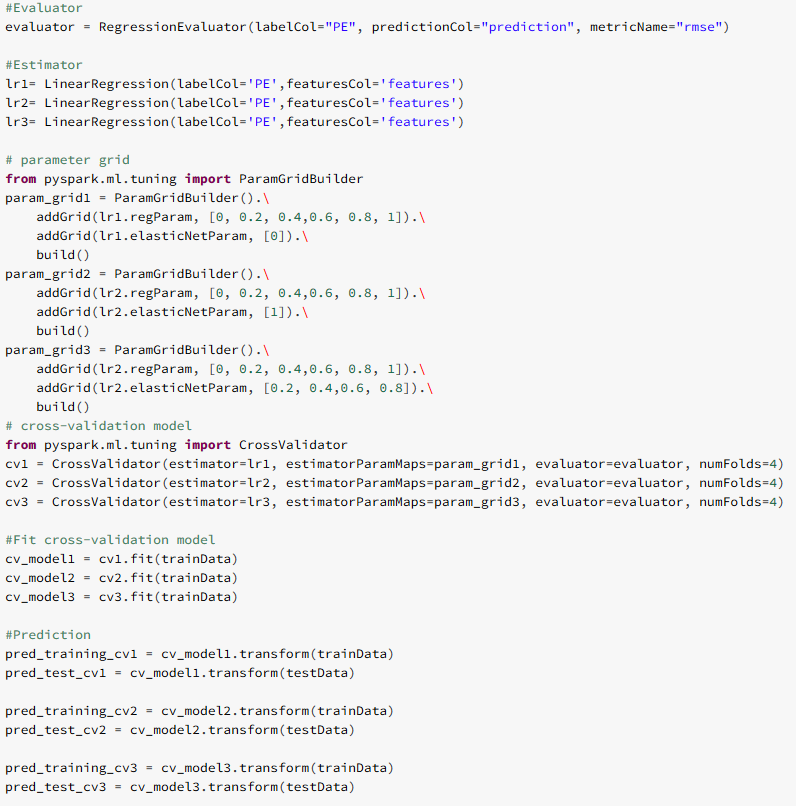 

- We create our 3 models: an elastic model, a ridge and a lasso
- We create the grid parameters to improve them through cross validation
- We test 5 parameters for each type of regression  and the elastic net Param
- We implement 4 Folds
- We calculate how well we performed:

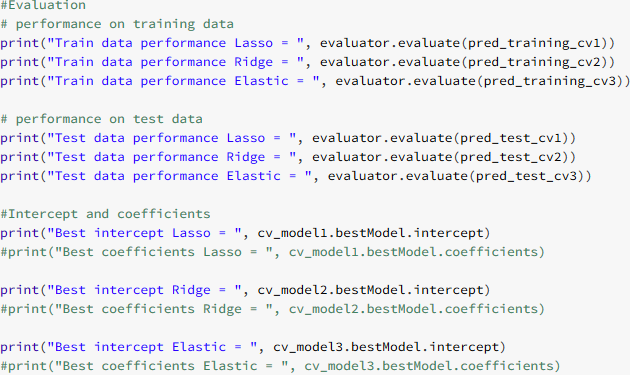 

Result:

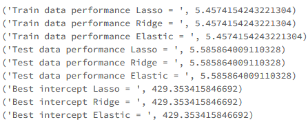 

- Moving the Elastic parameter seems not to change the effectiveness of our model

## Building the Decision Tree and random Forest models

We almost the same thing we did before but adapting the parameters:

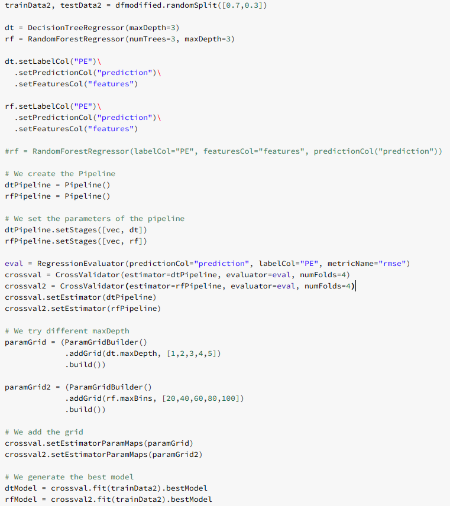 

- We split our data between train and test
- We create our models (Decision tree and Random forest)
- We process our data to be able to use them with the cross validator
- We create a 4 folder cross validator
- We try different parameters of depth and Bining for the 2 models
- We choose the best of them

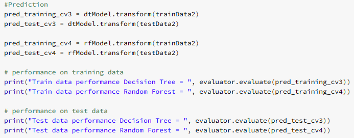 

- We then verify our score:

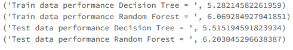 

- As we can see the Decision Tree seems to be a better model here since the RMSE is less important

## Conclusion

Score sum up:

| **Model \ Score** | **Train** | **Test** | **Mean** |
| --- | --- | --- | --- |
| **Best Elastic Linear** | 5.4574154243221304 | 5.585864009110328 | 5.52163971 |
| **L1 Linear (Ridge)** | 5.4574154243221304 | 5.585864009110328 | 5.52163971 |
| **L2 Linear (Lasso)** | 5.4574154243221304 | 5.585864009110328 | 5.52163971 |
| **Decision Tree** | 5.28214582261959 | 5.515194591823934 | 5.399 |
| **Random Forest** | 6.069284927941851 | 6.203045296638387 | 6.136 |

- The score are quite close, but the **best model** seems here to be **Decision Tree or Elastic Linear**
